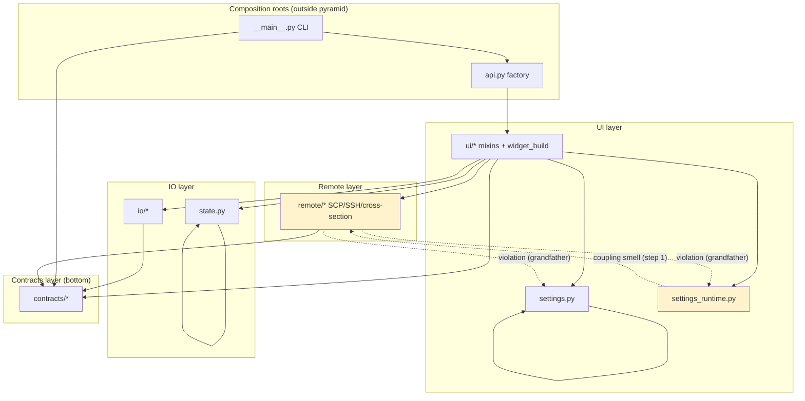

# Layer Boundaries

Maintainer-facing boundary map for the `linumpy_manual_align` package. Dependencies flow **downward only** through a strict pyramid (D-02). Root modules are first-class layers (D-01); composition roots sit outside the stack (D-03).

Enforcement runs locally via `uv run lint-imports`. CI wiring is out of scope for this document.

## Layer stack

Bottom to top:

1. **`contracts/`** — pure data contracts, layout rules, upload readiness
2. **`io/`** — image processing, transform I/O, optional OME-Zarr loading
3. **`state.py`** — alignment state dataclass and undo stack (io-level)
4. **`remote/`** — SCP/SSH workers, cross-section manager, server config parsing
5. **`settings.py`** — `AppSettings` singleton (ui-level)
6. **`settings_runtime.py`** — runtime settings adapter (ui-level)
7. **`ui/`** — napari dock widget mixins and build helpers (top layer)

**Composition roots (outside pyramid):** `api.py`, `__main__.py` — may import any layer; no layer may import them.

## Layer diagram

Solid arrows show allowed downward dependencies. Dashed arrows show known violations or coupling smells scheduled for removal.

## Allowed / forbidden import matrix

Rows are **source** layers; columns are **target** layers. A cell marked **allowed** means the source may import the target (downward). **Forbidden** means the import violates the pyramid.

| Source ↓ / Target → | contracts | io | state | remote | settings | settings_runtime | ui | api | __main__ |
|---------------------|-----------|-----|-------|--------|----------|------------------|-----|-----|----------|
| contracts | — | forbidden | forbidden | forbidden | forbidden | forbidden | forbidden | forbidden | forbidden |
| io | allowed | — | forbidden | forbidden | forbidden | forbidden | forbidden | forbidden | forbidden |
| state | forbidden | forbidden | — | forbidden | forbidden | forbidden | forbidden | forbidden | forbidden |
| remote | allowed | forbidden | forbidden | — | **grandfather** | **grandfather** | forbidden | forbidden | forbidden |
| settings | forbidden | forbidden | forbidden | forbidden | — | forbidden | forbidden | forbidden | forbidden |
| settings_runtime | allowed | forbidden | forbidden | allowed* | forbidden | — | forbidden | forbidden | forbidden |
| ui | allowed | allowed | allowed | allowed | allowed | allowed | — | forbidden | forbidden |
| api | allowed | allowed | allowed | allowed | allowed | allowed | allowed | — | forbidden |
| __main__ | allowed | allowed | allowed | allowed | allowed | allowed | allowed | allowed | — |

\* `settings_runtime → remote` is **downward** (pyramid-legal) but is a **coupling smell** — the ui adapter should not depend on remote types long-term. Scheduled for decoupling in refactor step 1.

## Documented violations (scheduled for removal)

These three edges are grandfathered in `[tool.importlinter]` until settings-boundary decoupling (refactor step 1) removes them:

| Source module | Target | Removal step |
|---------------|--------|--------------|
| `remote/cross_section.py` | `settings.settings` | Step 1: inject nudge/settings via constructor or protocol |
| `remote/cross_section.py` | `settings_runtime.cross_section_nudge_px` | Step 1: pass int parameter from ui |
| `remote/cs_script.py` | `settings.settings` | Step 1: read env/parameter; remote script already supports env var precedence |

Each matching entry in `pyproject.toml` `[tool.importlinter]` carries the same removal-step comment.

## Coupling smell (not a pyramid breach)

| Source | Target | Note |
|--------|--------|------|
| `settings_runtime.py` | `remote.ServerConfig` | Downward import (ui-level → remote). Not grandfathered in import-linter. Decouple in step 1 by introducing a neutral config protocol or plain dataclass passed from ui. |

## Enforcement

- **Local:** `uv run lint-imports` — eight contracts (pyramid + composition roots + six per-layer forbidden)
- **Config:** `pyproject.toml` `[tool.importlinter]`
- **CI:** deferred to a later phase

See also: [REFACTOR-SEQUENCE.md](./REFACTOR-SEQUENCE.md) for the ordered remediation plan.
